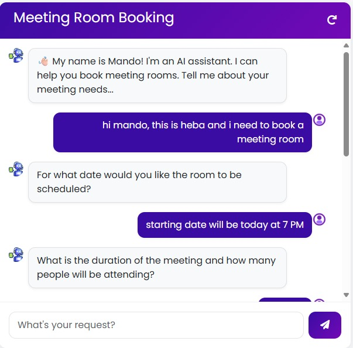

# Meeting Room Booking Agent

An intelligent AI-powered meeting room booking system built with LangGraph and advanced natural language processing capabilities. The system provides seamless room reservation through conversational interfaces, featuring automated availability checking, smart scheduling, and comprehensive booking management.

<p align="center">
  
</p>

## Overview

The Meeting Room Booking Agent leverages state-of-the-art language models to transform natural language requests into structured booking operations. Built on the LangGraph framework, it provides enterprise-grade workflow orchestration with intelligent fallback mechanisms and user clarification loops.

## Key Features

### 🤖 Intelligent Natural Language Processing
- Advanced request parsing with context understanding
- Multi-turn conversation support with memory retention
- Automatic extraction of booking parameters (time, capacity, equipment)

### 📅 Smart Scheduling & Availability
- Real-time room availability checking
- Conflict detection and resolution
- Alternative suggestion engine for optimal scheduling

### 🔄 Adaptive Workflow Management
- Dynamic clarification loops for incomplete requests
- State-aware conversation handling
- Robust error recovery mechanisms

### 🌐 Modern Web Interface
- Responsive design optimized for all devices
- Real-time chat interface with typing indicators
- Intuitive booking confirmation flows

### 🔧 Flexible Architecture
- Modular design supporting multiple LLM providers
- JSON-based data layer for rapid prototyping
- Extensible plugin system for custom integrations

## System Architecture

<p align="center">
  
</p>

### Core Components

| Component | Technology | Purpose |
|-----------|------------|---------|
| **AI Agent Engine** | LangGraph + Groq API | Orchestrates booking workflows and natural language understanding |
| **Web Interface** | Flask + HTML/CSS | Provides user interaction layer with responsive design |
| **Data Layer** | JSON Database | Manages room inventory and booking records |
| **Booking Service** | Mock API | Handles reservation logic and calendar integration |

## Installation & Setup

### Prerequisites

- **Python**: 3.11.0 or higher
- **Conda**: Miniconda or Anaconda distribution
- **API Access**: Groq API key (or compatible LLM service)

### Quick Start

1. **Environment Setup**
   ```bash
   conda create -n meeting_room_agent python=3.11 -y
   ```

   ```bash
   conda activate meeting_room_agent
   ```

2. **Dependency Installation**
   ```bash
   pip install -r requirements.txt
   ```

3. **Configuration**
   
   Create a `.env` file in the project root:
   ```env
   GROQ_API_KEY=your_groq_api_key_here
   FLASK_ENV=development
   FLASK_DEBUG=True
   ```

4. **Launch Application**
   ```bash
   flask run
   ```

   Access the application at `http://localhost:5000`

## Project Structure

```
meeting-room-booking-agent/
├── app.py                      # Flask application entry point
├── config.py                   # Application configuration
├── helper.py                   # Utility functions and helpers
├── requirements.txt            # Python dependencies
├── .env.example               # Environment variables template
│
├── booking_agent/             # Core AI agent components
│   ├── __init__.py
│   ├── conditions.py          # Workflow transition conditions
│   ├── nodes.py              # LangGraph node definitions
│   ├── prompt_config.py      # System prompts and templates
│   ├── schemas.py            # Pydantic data models
│   └── workflow.py           # LangGraph workflow orchestration
│
├── mock_apis/                 # Mock service layer
│   ├── __init__.py
│   ├── booking_services.py   # Booking API simulation
│   └── room_services.py      # Room data management
│
├── static/                    # Frontend assets
│   ├── style.css             # Application styles
│   └── js/                   # JavaScript modules
│
├── templates/                 # Jinja2 templates
│   └── index.html            # Main application interface
│
├── data/                      # Data storage (JSON files)
│   ├── rooms.json            # Room definitions and metadata
│   ├── bookings.json         # Active booking records
│   └── clarification_messages.json  # Fallback clarification templates
│
└── docs/                      # Documentation and diagrams
    ├── Project_Documentation.md
    ├── system_architecture.svg
    ├── flowchart.svg
    └── chatbot.jpg
```

## Supported Language Models

### Primary Integration
- **Groq API** (Default): LLaMA3-8b-8192 with optimized inference
- **Temperature**: 0.5 for balanced creativity and consistency

### Alternative Providers
- **Ollama**: Local model deployment for privacy-sensitive environments
- **OpenAI GPT**: Enterprise-grade language understanding
- **Anthropic Claude**: Advanced reasoning capabilities
- **Custom LLMs**: Via LangChain integration layer

## Agent Workflow

<p align="center">
  
</p>

### Workflow States

| State | Description | Transitions |
|-------|-------------|-------------|
| **Parse Request** | Extract booking parameters from natural language | → Find Rooms / Request Clarification |
| **Find Rooms** | Filter rooms by capacity and equipment requirements | → Check Availability / End |
| **Check Availability** | Verify time slot availability | → Show Options / Suggest Alternatives |
| **Get Confirmation** | Present options and await user decision | → Reserve Room / End |
| **Reserve Room** | Execute booking transaction | → Send Confirmation |

## Data Management

### Room Schema
```json
{
  "id": 1,
  "name": "Conference Room Alpha",
  "capacity": 12,
  "equipments": ["Projector", "Whiteboard", "Video Conference"],
  "location": "Floor 2, East Wing",
  "amenities": ["WiFi", "Power Outlets", "Climate Control"]
}
```

### Booking Schema
```json
{
  "room_id": 1,
  "start_time": "2025-01-15T14:00:00Z",
  "end_time": "2025-01-15T15:30:00Z",
  "booked_by": "John Doe",
  "purpose": "Team Standup",
  "attendees": 8
}
```

## API Reference

### Core Endpoints

| Endpoint | Method | Description |
|----------|--------|-------------|
| `/` | GET | Main application interface |
| `/chat` | POST | Process booking requests |
| `/api/rooms` | GET | Retrieve available rooms |
| `/api/bookings` | GET/POST | Manage booking records |

## Development & Deployment

### Development Mode
```bash
export FLASK_ENV=development
export FLASK_DEBUG=True
flask run --host=0.0.0.0 --port=5000
```

### Production Considerations
- Replace JSON storage with production database (PostgreSQL, MongoDB)
- Implement proper authentication and authorization
- Add rate limiting and request validation
- Configure HTTPS and security headers
- Set up monitoring and logging infrastructure

## Contributing

We welcome contributions! Please see our [Contributing Guidelines](CONTRIBUTING.md) for details on:
- Code style and standards
- Testing requirements
- Pull request process
- Issue reporting

## License

This project is licensed under the MIT License - see the [LICENSE](LICENSE) file for details.

## Support & Documentation

- **Full Documentation**: [docs/Project_Documentation.md](docs/Project_Documentation.md)
- **API Reference**: Available in the `/docs` directory
- **Issue Tracking**: GitHub Issues
- **Discussions**: GitHub Discussions

---

**Built with ❤️ using LangGraph, Flask, and modern AI technologies**
